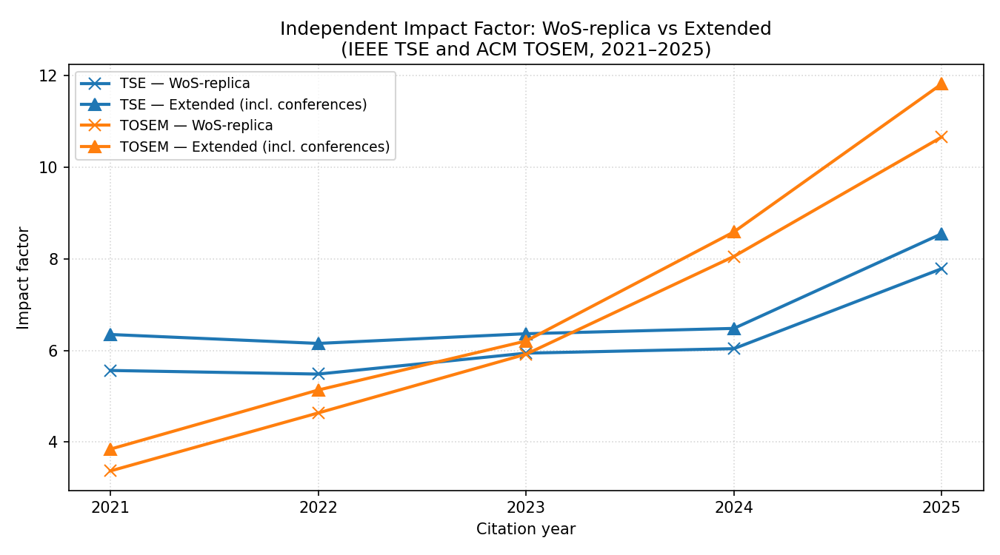
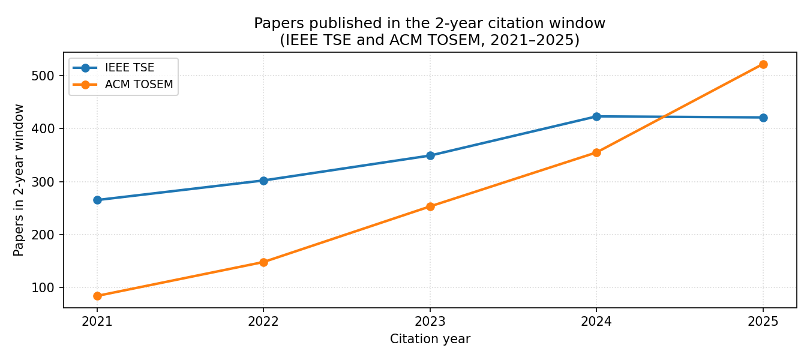

# Independent Impact Factor 2025

- Data source: Semantic Scholar API
- Publication window: 2023-2024
- Citation year: 2025
- Formula: citations_2025 / papers_2023_2024

| Journal | Papers (2023-2024) | Citations (2025) | IF 2025 |
| --- | ---: | ---: | ---: |
| IEEE TSE | 421 | 3598 | 8.5463 |
| ACM TOSEM | 522 | 6168 | 11.8161 |
| Springer EMSE | 331 | 1652 | 4.9909 |
| JSS | 521 | 2462 | 4.7255 |
| IST | 400 | 2219 | 5.5475 |

## WoS-replica vs extended IF (TSE and TOSEM, 2021–2025)

The extended mode (which counts conference citations) gives a significantly higher IF than the WoS-replica for both journals. TOSEM operates in a different regime: its IF is substantially higher than TSE's under either mode.

## Papers published per year (TSE and TOSEM, 2021–2025)

The volume gap explains the IF gap: TOSEM went from ~84 to ~522 papers per year (6×). This is the same dynamic behind JSS leading Google Scholar's journal rankings.
